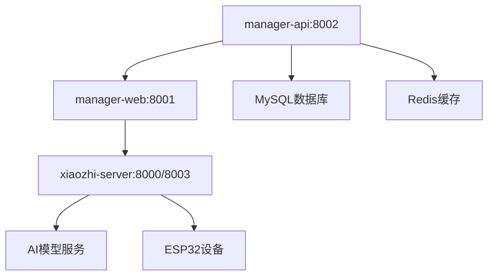

# XiaoZhi ESP32 服务端口和API文档

## 概述
XiaoZhi ESP32 服务器由三个主要服务组成，每个服务运行在不同的端口上，提供不同的功能和API接口。

## 服务架构

```
┌─────────────────┐    ┌─────────────────┐    ┌─────────────────┐
│   manager-api   │    │   manager-web   │    │ xiaozhi-server  │
│  (Spring Boot)  │────│   (Vue.js)      │────│   (Python)      │
│     端口8002    │    │     端口8001    │    │  端口8000/8003  │
└─────────────────┘    └─────────────────┘    └─────────────────┘
```

## 服务详情

### 1. Manager API Service (端口 8002)
**服务类型**: Spring Boot API 后端  
**技术栈**: Java 21, Spring Boot 3.4.3, MyBatis Plus, MySQL  
**主进程**: Java  
**访问地址**: http://localhost:8002

#### 🔗 API接口
- **Swagger文档**: http://localhost:8002/xiaozhi/doc.html
- **基础路径**: `/xiaozhi`

#### 📋 主要功能
- 用户认证和授权 (Apache Shiro)
- 系统管理接口
- 配置管理 (AI模型配置、参数设置)
- 数据库操作 (用户、配置、日志等)
- 短信服务集成 (阿里云SMS)
- Redis缓存管理

#### 🛠 技术特性
- **安全框架**: Apache Shiro 2.0.2
- **数据库**: MySQL + Druid连接池
- **缓存**: Redis (Lettuce客户端)
- **API文档**: Knife4j + SpringDoc
- **验证码**: EasyCaptcha
- **数据库迁移**: Liquibase

---

### 2. Manager Web Service (端口 8001)
**服务类型**: Vue.js 前端开发服务器  
**技术栈**: Vue.js, Vue CLI  
**主进程**: Node.js  
**访问地址**: http://localhost:8001

#### 🖥 前端功能
- 管理后台界面
- 用户管理界面
- 系统配置界面
- AI模型配置界面
- 实时状态监控
- 响应式设计

#### 🛠 技术特性
- **框架**: Vue.js (开发模式)
- **构建工具**: Vue CLI
- **开发服务器**: Webpack Dev Server
- **热重载**: 支持实时代码更新

#### 📝 注意事项
- 当前运行在开发模式
- 生产环境建议使用 `npm run build` 构建静态文件

---

### 3. XiaoZhi Server Service (端口 8000 + 8003)
**服务类型**: Python 后端服务  
**技术栈**: Python, WebSocket, HTTP  
**主进程**: Python3  

#### 🔌 端口分配

##### 端口 8000 - WebSocket服务
**访问地址**: ws://172.17.110.229:8000/xiaozhi/v1/  
**协议**: WebSocket  
**用途**: 实时通信

##### 端口 8003 - HTTP服务
**访问地址**: http://0.0.0.0:8003  
**协议**: HTTP  
**用途**: REST API和文件服务

#### 🔗 API接口

##### WebSocket API (端口 8000)
```
ws://172.17.110.229:8000/xiaozhi/v1/
```
- 实时语音交互
- 设备状态同步
- 命令响应处理

##### HTTP API (端口 8003)
```
http://0.0.0.0:8003
```

**主要端点**:
- `GET /` - 服务状态检查
- `POST /api/upload/image` - 图片上传接口
- `GET /uploads/*` - 静态文件访问
- `POST /mcp/vision/explain` - 视觉分析接口

#### 📋 主要功能
- **语音识别**: ASR (Automatic Speech Recognition)
- **文本转语音**: TTS (Text to Speech) 
- **自然语言处理**: NLP对话处理
- **视觉分析**: 图像理解和分析
- **设备通信**: ESP32设备管理
- **文件管理**: 图片上传和静态文件服务
- **模型集成**: 多种AI模型支持

#### 🛠 技术特性
- **异步处理**: 支持并发请求
- **模块化设计**: 可插拔组件架构
- **配置管理**: 动态配置加载
- **日志系统**: 结构化日志记录
- **错误处理**: 自动重试机制

---

## 服务依赖关系



### 启动顺序
1. **manager-api** (端口8002) - 提供基础API服务
2. **manager-web** (端口8001) - 依赖API服务的前端界面
3. **xiaozhi-server** (端口8000/8003) - 依赖前端配置的核心AI服务

---

## 快速访问

| 服务 | 地址 | 描述 |
|------|------|------|
| API文档 | http://localhost:8002/xiaozhi/doc.html | Swagger接口文档 |
| 管理后台 | http://localhost:8001 | Web管理界面 |
| WebSocket | ws://172.17.110.229:8000/xiaozhi/v1/ | 实时通信接口 |
| 文件服务 | http://localhost:8003/uploads/ | 静态文件访问 |
| 图片上传 | http://localhost:8003/api/upload/image | 图片上传API |
| 视觉分析 | http://localhost:8003/mcp/vision/explain | AI视觉分析 |

---

## 服务管理

使用提供的管理脚本：

```bash
# 查看所有服务状态
sudo ./install-all-services.sh status

# 启动所有服务
sudo ./install-all-services.sh start

# 停止所有服务
sudo ./install-all-services.sh stop

# 重启所有服务
sudo ./install-all-services.sh restart

# 查看服务日志
sudo ./install-all-services.sh logs [服务名]
```

---

## 端口总览

| 端口 | 服务 | 协议 | 功能 |
|------|------|------|------|
| 8000 | xiaozhi-server | WebSocket | 实时通信 |
| 8001 | manager-web | HTTP | Web前端 |
| 8002 | manager-api | HTTP | REST API |
| 8003 | xiaozhi-server | HTTP | 文件服务 |

---

## 安全注意事项

1. **生产环境配置**:
   - 修改默认端口
   - 配置防火墙规则
   - 启用HTTPS/WSS
   - 设置访问控制

2. **认证授权**:
   - API接口需要token认证
   - 管理后台需要登录
   - WebSocket连接需要验证

3. **数据保护**:
   - 敏感数据加密存储
   - 定期备份数据库
   - 监控异常访问

---

## 故障排除

### 端口冲突
如果端口被占用，检查进程：
```bash
ss -tlnp | grep :[端口号]
```

### 服务无法启动
查看服务日志：
```bash
sudo journalctl -u [服务名] -f
```

### 依赖问题
确保服务按正确顺序启动，检查依赖服务状态。

---

*最后更新: 2025年8月4日*
