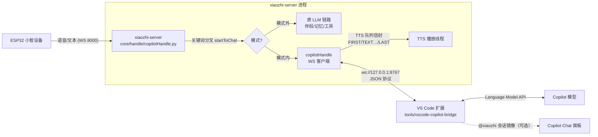

# Copilot 桥接方案（小智 ⇄ VS Code Copilot Chat）

> 2026-09-26 定稿。需求问答已确认：**可切换模式 / VS Code 扩展接入 / 本机 localhost / 口语化限长 / 每设备多轮 / 纯问答无工具**。
> 状态：P1 服务端（本提交）；P2 VS Code 扩展（`tools/vscode-copilot-bridge/`）；P3 联调。
> 相关：`docs/singleton-mode-plan.md`（单设备形态）、`main/xiaozhi-server/core/handle/copilotHandle.py`（实现）。

## 1. 目标与边界

把 ESP32 小智设备变成 VS Code Copilot Chat 的「语音对讲口」：

1. 设备说「**问 Copilot ……**」→ 进入 Copilot 模式（无内容时只进模式并回一句提示）；
2. 模式内所有语音/文本转发到本机 VS Code 的 Copilot（经扩展桥接），回复**由设备播报**（口语化、限长）；
3. 说「**退出 Copilot**」回到常规对话；模式外完全不介入原有链路（伴侣/记忆/工具调用不受影响）。

明确不做（本轮）：

- ❌ 主动推送（VS Code 侧 Copilot 回复主动播报到设备）——未选择，且依赖固件侧主动发声支持；
- ❌ 工具权限（读文件/执行命令）——纯问答；Coding Agent 能力后续如需另开开关；
- ❌ 跨机部署——本机 localhost；跨机（树莓派）留地址/令牌扩展位；
- ❌ 全接管（设备对话全走 Copilot）——保持可切换，默认不影响产品线。

## 2. 总体架构



- 桥接断连（VS Code 未开/扩展未启用）时只播报一句提示，不影响常规对话。
- 设备→服务器仍走原有 WS/ASR/TTS 管线；本功能只改「文本进 LLM 之前」的一个分叉点。

## 3. 服务端设计（已实现，P1）

### 3.1 拦截点

`core/handle/receiveAudioHandle.py` 的 `startToChat(conn, text, source="user")`：

- 语音（ASR）与文本两条路都汇聚到这里，**唯一分叉点**（先例：`agent_approval` 审批链路拦截）；
- 新增 `source` 参数区分真实用户输入与系统伪输入：唤醒问候（`textHandle.py`，`source="system"`）与超时结束语（`receiveAudioHandle.py`，`source="system"`）**不参与**关键词匹配；
- 分叉位置在审批拦截之后、`handle_user_intent` 之前：命中即由 `copilotHandle` 接管并 `return True`。

### 3.2 模块职责（`core/handle/copilotHandle.py`）

| 功能 | 实现 |
|---|---|
| 关键词匹配 | 去空白/标点/大小写后前缀匹配；命中后按去噪字符数对齐，从原文剥出剩余内容 |
| 模式状态 | `conn.copilot_mode`（连接级，断连自然复位） |
| 转发 | `conn.executor` 线程内用 `websockets.sync` 连接扩展（每请求短连接，localhost 开销可忽略） |
| 播报 | 复刻 `connection.chat()` 的 TTS 信封：`FIRST`(ACTION) → 若干 `MIDDLE`(TEXT 增量) → `LAST`(ACTION)；`llm_finish_task=True` 保证 `stop` 状态发出 |
| 打断 | 复用既有机制：barge-in 由 `handleAbortMessage` 置 `client_abort` + 清队列；转发线程轮询 `client_abort/stop_event`，并向扩展发 `cancel` |
| 作废 | `conn._copilot_active_request`（request_id 标记）：新一轮/退出时旧转发线程自动失效，避免陈旧回包串入新句子 |
| 降级 | 连不上/超时/扩展报错且尚未出声时，播报一句短提示（如「Copilot 桥接没连上……」） |

### 3.3 配置（`config.yaml` / `config_singleton.yaml`）

```yaml
copilot_bridge:
  enabled: true                      # 总开关；关闭后关键词不生效
  url: ws://127.0.0.1:8767           # 扩展桥接监听地址（仅本机）
  connect_timeout: 3                 # 连接超时（秒）
  reply_timeout: 120                 # 整次回复超时（秒）
  enter_keywords: [问copilot, 问一下copilot, 问问copilot, 找copilot, 呼叫copilot]
  exit_keywords:  [退出copilot, 结束copilot, 关闭copilot, 收起copilot]
```

匹配忽略空格/中英标点/大小写（「问一下 Copilot，……」可命中 `问一下copilot`）。

## 4. 桥接协议（WS，JSON 单行）

服务端 → 扩展：

| type | 字段 | 说明 |
|---|---|---|
| `request` | `request_id, session_id, text` | 一次提问；`session_id = <device-id>#copilot`，扩展据此维护多轮上下文 |
| `cancel` | `request_id` | 打断/作废，扩展侧取消 LLM 请求（CancellationToken） |

扩展 → 服务端：

| type | 字段 | 说明 |
|---|---|---|
| `chunk` | `request_id, text` | 流式增量（已过滤 Markdown/代码块、含限长截断逻辑的结果） |
| `done` | `request_id, text` | 回复完成（`text` 为完整播报稿） |
| `error` | `request_id, message` | 失败（配额/无权限/模型不可用等），服务端降级播报 |

约定：扩展为**服务端**（监听 `127.0.0.1:8767`，仅本机）；服务端为客户端、每请求短连接。会话（多轮）由扩展按 `session_id` 持久于扩展内存。

## 5. VS Code 扩展设计（P2，`tools/vscode-copilot-bridge/`）

- **桥接服务**：Node `ws` 监听 127.0.0.1:8767；维护 `Map<session_id, LanguageModelChatMessage[]>` 多轮上下文；
- **模型调用**：`vscode.lm.selectChatModels({vendor:'copilot'})` + `model.sendRequest()`（流式）；首用需用户授权一次（Consent 弹窗，属正常流程）；
- **@xiaozhi 聊天参与者**：设备消息以 `@xiaozhi <text>` 形式注入当前 Chat 面板（`workbench.action.chat.open`），对话**在面板可见**；手动和它聊天也可（桥接状态、测试用）；
- **播报过滤（SpeechFilter）**：流式状态机——剔除代码围栏（替换为「代码部分略过」）、行内反引号、Markdown 记号、链接语法；超长截断（默认 ≤300 字，可配）；
- **口语化提示词**：系统消息约束「回复将被 TTS 朗读：短句、无 Markdown/代码/列表、总长受限、中文（除非用户用其他语言）」；
- **纯问答**：不注册工具；仅文本问答；
- **配额错误处理**：`LanguageModelError.Blocked/NoPermissions` → `error` 消息中文化（如「额度不足」）；服务端降级播报。

## 6. 失败模式与降级

| 场景 | 行为 |
|---|---|
| VS Code 关闭 / 扩展未加载 | 连接失败 → 播报「Copilot 桥接没连上，请确认 VS Code 已打开并启用了桥接扩展」 |
| 扩展返回 error（配额等） | 尚未出声则播报「Copilot 暂时用不了了：…」；已出声则静默结束 |
| 回复超时（默认 120s） | 未出声则播报超时提示 |
| 环境代理劫持 localhost（公司网络 `socks_proxy` 等） | 桥接客户端强制直连（websockets `proxy=None`）；测试含回归用例 |
| 用户中途打断（barge-in） | 既有打断机制生效；转发线程 ≤0.25s 内察觉并给扩展发 `cancel` |
| 模式内说「再见」等常规退出词 | 仍走 `check_direct_exit`（关闭连接等标准行为不受影响） |
| 唤醒问候 / 超时结束语 | `source="system"` 直通原链路，不会误转发给 Copilot |

## 7. 安全与配额

- 桥接仅绑定 127.0.0.1，无外部暴露；跨机需求出现时再加地址配置 + 共享令牌。
- 对话内容出境到 Copilot 服务（与 VS Code 内聊天同性质）；私人内容敏感者注意。
- **配额**：Copilot 模型调用消耗账号配额（实测 CLI 无头模式已报 402「月度配额超限」）；若长期受限，可改用其他 CLI/模型后端（协议不变，只换扩展内实现）。

## 8. 验收清单（P3）

1. 说「问 Copilot 一加一等于几」→ 进入模式，设备播报答案；追问「那二加二呢」→ 多轮上下文生效；
2. 说「退出 Copilot」→ 回「好的，已退出 Copilot」，之后对话回到伴侣大脑；
3. 模式内被打断（播报中再次说话）→ 立即停止，可继续追问；
4. 关掉 VS Code 后进入模式 → 听到桥接未连接提示，常规对话不受影响；
5. VS Code 侧 Chat 面板可见完整问答（镜像开启时）；
6. 播报内容口语化：无代码块、无 Markdown、长度受控（超长时有截断提示）。

## 9. 阶段与状态

| 阶段 | 内容 | 状态 |
|---|---|---|
| P1 | 服务端：copilotHandle + startToChat 分叉 + 配置 + 测试 | ✅ 本提交 |
| P2 | VS Code 扩展：桥接服务 + @xiaozhi 参与者 + SpeechFilter | ✅ 已实现（`tools/vscode-copilot-bridge/`，构建通过；待 reload 窗口联调） |
| P3 | 端到端联调（真机 + 面板可见性 + 打断/降级路径） | ⏳ 待做（需 reload 窗口 + 重启 xiaozhi-server + 设备实测） |

## 10. 开放项

- `workbench.action.chat.open` 注入的自动提交行为需在 1.138 实测；失败则自动退回「扩展直连模型 + 输出通道日志」路径（不影响设备侧）。
- 镜像开启时，注入消息会进入 `@xiaozhi` 面板会话（可见性所选）；手动输入与设备注入的区分用 FIFO 队列对齐。
- 模型选择：跟随面板所选模型（设备注入走参与者时）；直连路径用 `selectChatModels` 默认或配置指定。
- 语音识别英文词「Copilot」偶发拼写偏差（co-pilot 已兼容；其他变体可用 `enter_keywords` 配置增补）。
