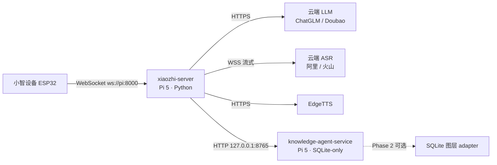

# 单例模式设计方案（单设备 · 树莓派 5 · Context Recall 记忆）

> **定稿**：2026-09-20 ｜ **状态**：设计闭环，待实现与部署
> **决策档案**：Continuity 决策库（`.continuity/decisions.jsonl`，2026-09-20 系列条目）
> **范围**：后端只服务一台小智设备（单例模式）；**资源与算力最大节省**为第一目标

## 1. 已定决策摘要

| 维度 | 决策 |
|---|---|
| 部署形态 | 单例模式：不部署 manager 栈（manager-api / manager-web / MySQL / Redis 均不部署） |
| 部署机 | Raspberry Pi 5 **4GB**（已确认；2GB 存在但余量薄，不采用） |
| 操作系统 | Raspberry Pi OS **Lite 64-bit**；首选 Bookworm（Python 3.11），Trixie（3.13）需先验证依赖兼容 |
| 网络 | 家庭部署：出网（云服务）+ 局域网（设备 ↔ Pi）；不依赖办公网络 |
| LLM | **全部云端**（默认智谱 glm-4-flash 免费款；稳定后建议 DoubaoLLM） |
| ASR | **云端流式**（`aliyun_stream` / `doubao_stream` 二选一） |
| TTS / VAD | EdgeTTS（云端免费）；Silero VAD（本地轻量） |
| 记忆 | **Context Recall 本地实例**（knowledge-agent-service，SQLite-only 起步，graph-off） |
| 角色 | 静态单角色；角色协议扩展（设备端携带 role）后置，等固件联调时定 |
| 需求边界 | 无控制台；改配置 = 改 `data/.config.yaml` + 重启 |

## 2. 总体架构

Pi 上两个 user 级 systemd 服务：

- `xiaozhi-server`：8000（WebSocket）、8003（HTTP：OTA / 视觉 / 审批端点）
- `knowledge-agent-service`：127.0.0.1:8765（仅本机回环，不暴露局域网）

## 3. 部署形态（Pi 侧）

- **OS**：Raspberry Pi OS Lite 64-bit（无桌面）；官方 Imager 烧录时预置 WiFi / SSH / 用户
- **硬件**：官方 27W USB-C 电源、主动散热；存储建议 NVMe（M.2 HAT+），底线 A2 级 32GB+ SD
- **服务**：两个 user 级 systemd + linger（开机自启，无需登录）；CR 用自带 `scripts/install-user-service.sh`
- **已知修正项**：
  - `main/xixaozhi-server.service`：**移除 `Requires=manager-web.service`**、修正 WorkingDirectory/User、ExecStart 改用 venv 解释器
  - 依赖裁剪（可选）：不启用 FunASR 时可从 `requirements.txt` 移除 torch/funasr/modelscope 等（省磁盘，需回归验证）
- **备份**：定期备份 CR 数据目录 `~/.local/share/knowledge-agent-service`

## 4. 记忆集成（Context Recall）

### 4.1 服务事实（已按代码核实）

- **API**：`GET /health`、`/v1/stats`、`/v1/capabilities`；`POST /v1/search`、`/v1/import/{extension,continuity,documents}`、`/v1/graph/*`
- **存储**：`memory_units`（raw / candidate / active + FTS5）+ 向量库 +（可选）Neo4j；**turns/sessions 不落库**（仅用于 evidence 解析与 scope 映射）
- **可检索门槛**：`status='active' AND memory_kind='memory' AND evidence 非空`
- 服务不调模型（组织由调用方完成）；scope 取自快照 `session.workspaceId`

### 4.2 保存路径（v2：xiaozhi 侧 LLM 组织）

1. 会话结束触发（同一连接内 **≥3 轮用户发言**才组织；长会话中途快照）
2. 本地保存 raw turns（证据源，服务端不落 turns）
3. 调组织 LLM（独立配置，可用便宜款）→ 按 organizer 规范产出：
   - 1 个会话摘要节点 + **≤8 知识节点 + ≤12 边**
   - 字段：kind / label / summary / confidence / tags / aliases；**evidenceTurnIds 必填**；status=active；确定性 ID（幂等）
4. 构造快照 `{session(workspaceId='xiaozhi'), turns, nodes, edges}` → `POST /v1/import/extension`
5. **降级链**：LLM 失败 / 坏 JSON → 零 LLM 最小节点（原文截断）；网络失败 → 本地 outbox 重试

### 4.3 查询路径

- 每轮对话前 `POST /v1/search`（`workspace_id=xiaozhi`、min_similarity≈0.35、limit≈6、timeout≈2.5s）
- 服务不可达 / 超时 → **空记忆降级**，对话不阻塞
- 结果组装为短文本注入对话（条数与长度受控，适合语音场景）

### 4.4 治理与隔离

- **workspace 隔离**：`xiaozhi`（可配置；session id 带设备号，预留多设备）
- 服务 additive **无删除**："遗忘" = 状态化（superseded 后不可检索）；本地 raw 可自行删除
- 联调测试数据以固定前缀 id 标记（与工程库物理同库、逻辑隔离）

## 5. 实现清单（xiaozhi 侧）

| 文件 / 模块 | 内容 |
|---|---|
| `core/providers/memory/context_recall/`（新） | provider：`save_memory`（快照 + 组织）/ `query_memory`（搜索）/ `init_memory`（scope） |
| 组织模块（新） | `organizer.ts` 规范移植（TS → Python）：prompt、JSON 容忍解析、确定性 ID、数量上限 |
| 快照 / outbox（新） | 快照构造、失败重试队列、本地 raw turns 存储 |
| `config.yaml` / `data/.config.yaml` | `Memory` 配置块 + `selected_module.Memory` 切换 |
| `connection.py` | 复用现有 `_save_and_close` 异步模式，挂接保存流程（不改接口契约） |

## 6. 分阶段计划与验收

| 阶段 | 内容 | 验收标准 |
|---|---|---|
| **Phase 0 联调** | 一次性 CR 测试实例（空数据目录、独立端口）+ 伪造快照脚本 | 导入 → `/v1/search` 命中 → 幂等 → workspace 隔离 → 降级 |
| **Phase 1 实现** | provider + 组织 + 快照 + outbox | 本机对 CR 实例端到端；真实对话可召回 |
| **Phase 2 Pi 部署** | OS + 双服务 + 联调脚本复跑 | pip aarch64 wheels 齐全；内存峰值 / 温度 10 分钟稳定；设备端到端语音 |
| **Phase 3 可选** | CR 侧 SQLite 图层 adapter；图算法（PPR / 社区发现） | 组织层上线后按需 |

## 7. CR 侧改动（Phase 2，短周期 feature 分支）

- `SqliteGraphStore` adapter（接口固定 8 方法：`health / search / upsert / entity_catalog / upsert_documents / mentions / document_links / relink`）；家庭实例先实现知识实体部分
- 配置：`KNOWLEDGE_GRAPH_BACKEND=neo4j|sqlite|none`；工程实例继续 Neo4j，两实例同 main、配置区分
- 不建 fork；向后兼容 + 测试；双实例验证后合回 main

## 8. 开放项（待定）

- 云凭据：流式 ASR 账号（阿里 / 火山二选一）；LLM 智谱免费款可先跑通
- 存储选型：NVMe vs SD（建议 NVMe）
- 完整模式（manager 栈）去留：决定 manager 侧角色切换改动的后续处置
- 角色协议扩展形态（hello 携带 role vs agent 消息携带）——建议 Pi 首版静态单角色

---

### 附：关键外部参考（开发机路径）

- 组织规范：`knowledge-agent-extension/src/organizer.ts`（prompt / schema / 限制 / 确定性 ID）
- 数据模型：`knowledge-agent-extension/src/model.ts`（KnowledgeSnapshot / KnowledgeNode / SessionRecord / TurnRecord）
- 服务实现：`knowledge-agent-service/src/knowledge_agent_service/{api.py, memory_store.py, migration.py}`
