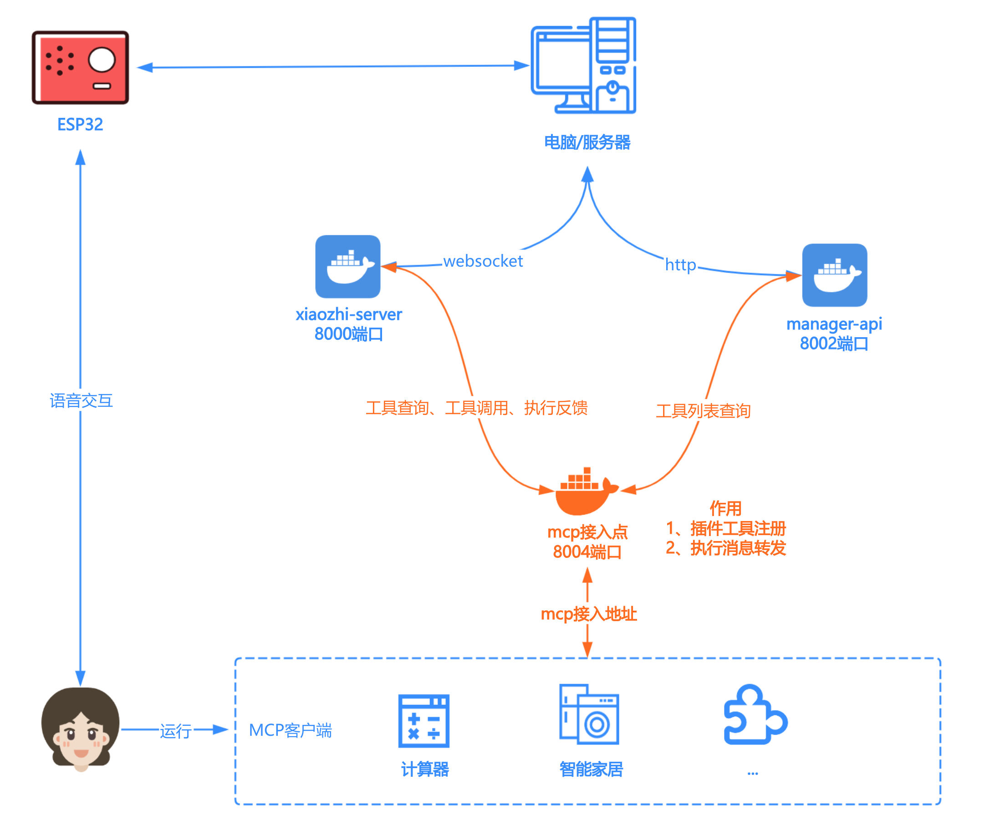

# MCP Endpoint Server

一个高效的xiaozhi mcp接入点服务器，用于[xiaozhi-server](https://github.com/xinnan-tech/xiaozhi-esp32-server)自定义mcp服务注册，方便拓展小智设备工具调用。

本项目是一个基于websocket的MCP注册中心，功能单一，建议使用Docker运行。

## 功能特性

- 🚀 **高性能**: 基于FastAPI和WebSocket的异步架构，支持高并发
- 🔄 **消息转发**: 自动转发工具端和小智端之间的消息
- 🔒 **连接管理**: 智能管理WebSocket连接，支持连接清理
- 📊 **监控统计**: 提供连接统计和健康检查接口
- ⚙️ **配置灵活**: 支持配置文件管理，易于部署和维护
- 🛡️ **错误处理**: 完善的错误处理和日志记录

## 架构设计

## 接入教程

[MCP 接入点部署使用指南](https://github.com/xinnan-tech/xiaozhi-esp32-server/blob/main/docs/mcp-endpoint-integration.md)

## 技术细节
[技术细节](./README_dev.md)
